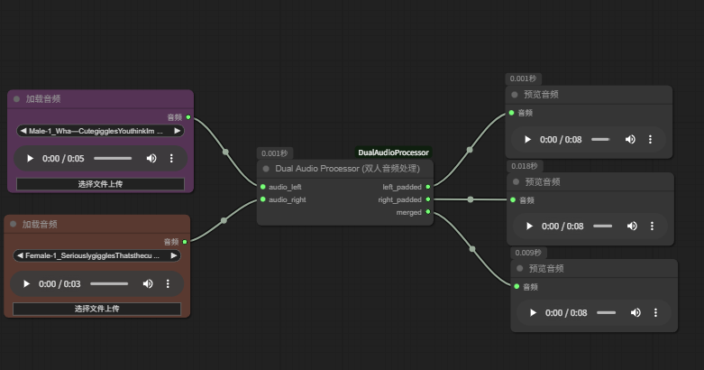
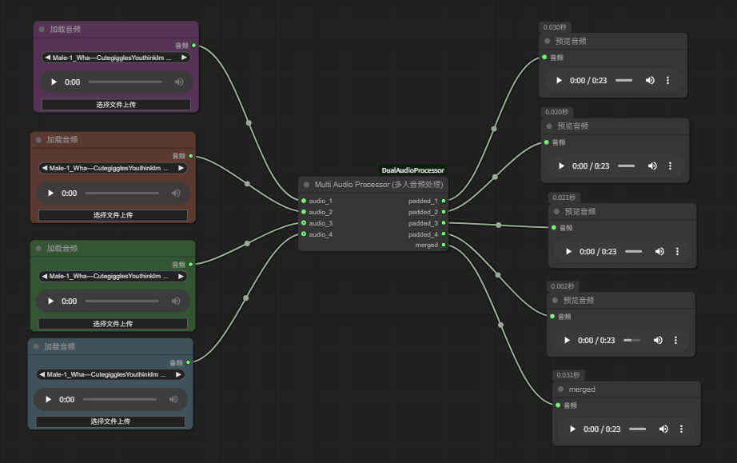

# ComfyUI-DualAudioProcessor

ComfyUI custom nodes for multi-person digital human audio processing, designed for InfiniteTalk workflows.

## Overview

When creating multi-person talking head videos, each person needs to speak in sequence. These nodes process multiple audio tracks into equal-length outputs with proper silence padding.

Example: Person A speaks for 3s, Person B speaks for 2s:
- Output A: 3s audio + 2s silence
- Output B: 3s silence + 2s audio
- Merged: 5s continuous audio (A → B)

## Demo

https://github.com/user-attachments/assets/示例视频.mp4

## Nodes

### DualAudioProcessor

For two-person dialogue.



**Inputs:**
| Name | Type | Description |
|------|------|-------------|
| audio_left | AUDIO | First speaker's audio |
| audio_right | AUDIO | Second speaker's audio |

**Outputs:**
| Name | Type | Description |
|------|------|-------------|
| left_padded | AUDIO | First audio + silence padding |
| right_padded | AUDIO | Silence padding + second audio |
| merged | AUDIO | Concatenated audio (no silence) |

### MultiAudioProcessor

For 2-4 person scenarios.



**Inputs:**
| Name | Type | Required |
|------|------|----------|
| audio_1 | AUDIO | Yes |
| audio_2 | AUDIO | Yes |
| audio_3 | AUDIO | No |
| audio_4 | AUDIO | No |

**Outputs:**
| Name | Type | Description |
|------|------|-------------|
| padded_1~4 | AUDIO | Each speaker's padded audio |
| merged | AUDIO | All audio concatenated |

## Installation

```bash
cd ComfyUI/custom_nodes
git clone https://github.com/ALIoneTreE1119/ComfyUI-DualAudioProcessor.git
```

Restart ComfyUI.

## Workflow

See `workflow/InfiniteTalk双人数字人对口型.json` for a complete example.

## Requirements

- torch
- torchaudio

Both are included with ComfyUI by default.

## Credits

Based on the workflow by [YZ_金鱼](https://space.bilibili.com/14843708) on Bilibili.

## License

MIT
